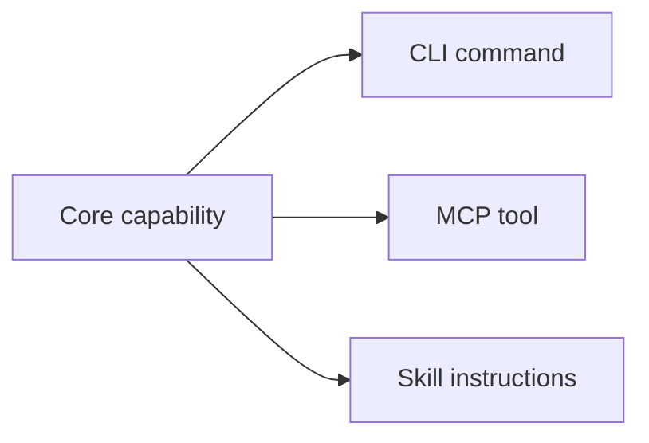
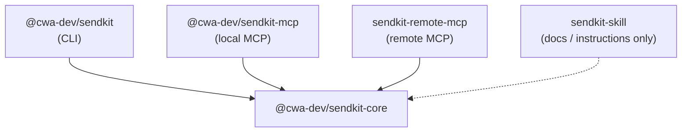

<p align="center">
  
</p>

<h1 align="center">SendKit</h1>

<p align="center">
  Build agent-ready tools with one shared TypeScript core for MCP, CLI, and Skills.
</p>

<p align="center">
  by <a href="https://x.com/codewithantonio">@codewithantonio</a>
</p>

<p align="center">
  <a href="./LICENSE"></a>
  <a href="https://www.npmjs.com/package/@cwa-dev/sendkit"></a>
  <a href="https://github.com/code-with-antonio/sendkit"></a>
  <a href="https://cwa.run/railway"></a>
  <a href="https://cwa.run/clerk"></a>
</p>

> **Prompt:** "Send Antonio a Telegram message saying the build shipped."
>
> **Agent:** Uses SendKit's `telegram` MCP tool with `{ "chatId": "...", "message": "The build shipped." }`, backed by the same core operation available from the CLI and Skill.

## Quick Start

```bash
npm install -g @cwa-dev/sendkit
sendkit init --telegram-bot-token "<bot-token>"
sendkit telegram "<chat-id>" "Hello from SendKit"
```

<details>
<summary><strong>Table of contents</strong></summary>

- [Video Tutorial](#video-tutorial)
- [What Is SendKit?](#what-is-sendkit)
- [Who This README Is For](#who-this-readme-is-for)
- [What Is Included](#what-is-included)
- [Prerequisites](#prerequisites)
- [Use SendKit](#use-sendkit)
- [Fork Or Adapt SendKit](#fork-or-adapt-sendkit)
- [Run Locally](#run-locally)
- [Architecture Details](#architecture-details)
- [Telegram Operation](#telegram-operation)
- [Publish Packages To NPM](#publish-packages-to-npm)
- [Troubleshooting](#troubleshooting)

</details>

## Video Tutorial

This repository is built from scratch, step by step, in a 4-hour tutorial:

**[The Only Guide You Need to Build Claude Skills and MCP Servers ▶](https://www.youtube.com/watch?v=YKIUt9ytxIE)**

It walks through the entire `core -> CLI -> MCP -> Skill` pattern, including the local and remote MCP adapters and Clerk-protected remote deployment.

## What Is SendKit?

SendKit is both a tutorial and a boilerplate for modern agent tooling. It shows how one shared operation can become a complete agent-facing toolkit: a CLI command, a local MCP tool, a remote MCP server, and Skill instructions.

The example operation sends Telegram messages, but the structure is intentionally easy to replace. Swap the operation in `packages/core`, update the adapters, and you have a strong starting point for a different product, internal tool, workflow automation, or agent capability.

The central pattern is:



Business logic lives in `packages/core`. Every other package is an adapter, so agents, scripts, and humans all use the same implementation instead of drifting copies.

## Who This README Is For

Start with the section that matches your goal:

- [Use SendKit](#use-sendkit): Install the published CLI, local MCP server, and Skill.
- [Fork Or Adapt SendKit](#fork-or-adapt-sendkit): Turn the boilerplate into your own agent tooling project.
- [Run Locally](#run-locally): Develop the tutorial or modify the packages from source.
- [Publish Packages To NPM](#publish-packages-to-npm): Release notes for maintainers.

## What Is Included

| Package | Role |
| --- | --- |
| `packages/core` | Shared schemas and operations. |
| `packages/cli` | Human/script CLI adapter. |
| `packages/local-mcp` | Local MCP stdio server adapter for AI clients. |
| `apps/remote-mcp` | Remote MCP HTTP adapter for deployed clients. |
| `skills/sendkit` | Agent-facing usage instructions. |

## Prerequisites

- A Telegram bot token.
- Node.js for published package usage.
- Bun if you want to run or adapt this repository locally.
- A Node-compatible MCP client if you want to connect the local MCP server.

## Use SendKit

Use this path when you want the published SendKit tools, not the source workspace.

### CLI

Install the CLI globally:

```bash
npm install -g @cwa-dev/sendkit
```

Configure your Telegram bot token:

```bash
sendkit init --telegram-bot-token "<bot-token>"
```

Send a message:

```bash
sendkit telegram "<chat-id>" "Hello from SendKit"
```

Use JSON output when scripting or when an agent needs to parse the result:

```bash
sendkit telegram "<chat-id>" "Hello from SendKit" --json
```

Expected JSON output:

```json
{
  "ok": true,
  "chatId": "<chat-id>",
  "messageId": 123
}
```

CLI config is stored at `~/.config/sendkit/config.json`.

### Local MCP

Install the local MCP stdio server globally:

```bash
npm install -g @cwa-dev/sendkit-mcp
```

Configure your MCP client to run `sendkit-mcp` and pass `TELEGRAM_BOT_TOKEN` through the server environment:

```json
{
  "mcpServers": {
    "sendkit": {
      "command": "sendkit-mcp",
      "args": [],
      "environment": {
        "TELEGRAM_BOT_TOKEN": "<bot-token>"
      }
    }
  }
}
```

If your MCP client can execute npm packages directly, skip the global install:

```json
{
  "mcpServers": {
    "sendkit": {
      "command": "npx",
      "args": ["-y", "@cwa-dev/sendkit-mcp"],
      "environment": {
        "TELEGRAM_BOT_TOKEN": "<bot-token>"
      }
    }
  }
}
```

Available MCP tools:

- `telegram`: Accepts `{ chatId, message }` and returns `{ ok, chatId, messageId }`.

Do not include Telegram bot tokens in MCP tool arguments. The local MCP server reads the token from `TELEGRAM_BOT_TOKEN`.

### Skill

Install the SendKit Skill with your skill manager:

```bash
npx skills add https://github.com/code-with-antonio/sendkit/tree/main/skills/sendkit
```

The Skill tells agents when to use the MCP `telegram` tool, when to fall back to the CLI, why `--json` matters for parsing, and why `@cwa-dev/sendkit-core` is only an implementation detail.

CLI fallback example from the Skill:

```bash
sendkit init --telegram-bot-token "<bot-token>"
sendkit telegram "<chat-id>" "Hello from SendKit" --json
```

### Remote MCP

This repository includes a remote MCP HTTP server, but SendKit does not provide a hosted public endpoint.

For remote MCP usage, deploy your own copy of `apps/remote-mcp`. The server exposes `POST /:botToken/mcp`, where `botToken` is the URL-encoded Telegram bot token for that request.

The remote MCP app can be protected with Clerk OAuth while keeping the Telegram bot token in the MCP URL:

```text
https://your-sendkit-host.example.com/<telegram-bot-token>/mcp
```

Treat this URL like a secret. The URL still contains the Telegram bot token. If it is exposed, revoke and rotate the token with BotFather.

Set Clerk environment variables before starting the remote MCP app:

```bash
CLERK_PUBLISHABLE_KEY="<publishable-key>" \
CLERK_SECRET_KEY="<secret-key>" \
bun run dev:remote-mcp
```

For MCP OAuth clients, unauthenticated requests receive `401 Unauthorized` with `WWW-Authenticate` metadata. The MCP client is responsible for opening the Clerk login flow.

In the Clerk Dashboard, enable **Dynamic client registration** for OAuth applications before testing with MCP clients that require automatic OAuth client registration.

This tutorial step demonstrates OAuth-protected MCP access. Clerk does not manage the Telegram bot token in this example; the token still comes from the URL.

ChatGPT web and Claude web support can vary by current MCP OAuth client behavior.

**Claude web** connects out of the box: it performs OAuth Dynamic Client Registration automatically, so no manual OAuth client setup is needed.

**ChatGPT** connectors and custom apps do **not** support Dynamic Client Registration. You must create your own OAuth client in the Clerk Dashboard, then:

- Copy ChatGPT's redirect/callback URI and add it to the allowed redirect URIs on your Clerk OAuth client.
- Provide the resulting **client ID** and **client secret** to ChatGPT when configuring the connector.

ChatGPT connector configuration:

```text
Name: SendKit
Description: Send Telegram messages through SendKit MCP.
MCP Server URL: https://your-sendkit-host.example.com/<telegram-bot-token>/mcp
Authentication: OAuth
```

Example OpenCode remote MCP config after you deploy your own server:

```json
{
  "$schema": "https://opencode.ai/config.json",
  "mcp": {
    "sendkit": {
      "type": "remote",
      "url": "https://your-host.example.com/{env:TELEGRAM_BOT_TOKEN}/mcp",
      "enabled": true
    }
  }
}
```

This keeps Telegram bot tokens user-specific and client-provided without exposing them as MCP tool arguments.

## Fork Or Adapt SendKit

Use this path when SendKit is a starting point for something else. The Telegram operation is deliberately small so you can replace it with your own API wrapper, internal workflow, SaaS integration, developer tool, or automation.

### What To Keep

Keep the dependency direction:

```text
packages/core        -> shared schemas and operations
packages/cli         -> command-line adapter backed by core
packages/local-mcp   -> local MCP stdio adapter backed by core
apps/remote-mcp      -> remote MCP HTTP adapter backed by core
packages/skills/...  -> agent-facing instructions and fallback guidance
```

Keep business logic in `packages/core`. Adapters should only parse inputs, read credentials from the right place, call core, and format results.

```text
CLI command = parse input + call core + print output
MCP tool    = validate input + call core + return structured result
Remote MCP  = read request auth + validate input + call core
Skill       = instructions for when/how to use CLI or MCP
```

### What To Replace

Most forks replace these SendKit-specific pieces:

- Package names in `package.json` files.
- Binary names such as `sendkit` and `sendkit-mcp`.
- The Telegram operation in `packages/core/src/schemas.ts` and `packages/core/src/operations.ts`.
- CLI commands in `packages/cli/src/index.ts`.
- MCP tool registrations in `packages/local-mcp/src/index.ts` and `apps/remote-mcp/src/index.ts`.
- Skill metadata and instructions in `skills/sendkit/SKILL.md`.
- README install, configuration, and verification commands.

### Add A New Operation

Follow the explicit registration flow:

1. Add input and output schemas in `packages/core/src/schemas.ts`.
2. Add the operation function in `packages/core/src/operations.ts`.
3. Export it through `packages/core/src/index.ts` when needed.
4. Add a CLI command in `packages/cli/src/index.ts`.
5. Add a local MCP tool in `packages/local-mcp/src/index.ts`.
6. Add a remote MCP tool in `apps/remote-mcp/src/index.ts` when remote support is part of your project.
7. Add usage notes in your Skill `SKILL.md`.
8. Add manual verification commands to the README.

SendKit intentionally keeps registration explicit. Do not introduce a shared operation registry until the adapter boundaries are clear.

### Credential Pattern

SendKit uses three credential paths because each interface has a different audience:

- CLI reads a persisted local user config created by `sendkit init`.
- Local MCP reads environment variables provided by the MCP client.
- Remote MCP reads the per-request Telegram bot token from the MCP URL path.

For your own project, keep credentials out of MCP tool input schemas unless the credential is genuinely part of the operation payload.

## Run Locally

Use this path when you are following the tutorial, maintaining the repo, or changing packages before publishing.

Install workspace dependencies:

```bash
bun install
```

Run the CLI from source:

```bash
bun run dev:cli init --telegram-bot-token "<bot-token>"
bun run dev:cli telegram "<chat-id>" "Hello from SendKit"
bun run dev:cli telegram "<chat-id>" "Hello from SendKit" --json
```

Start the local MCP stdio server from source:

```bash
TELEGRAM_BOT_TOKEN="<bot-token>" bun run dev:local-mcp
```

Expected behavior: the process stays open and waits for MCP messages over stdio. Stop it with `Ctrl-C` when testing manually.

Example MCP client config from the repository root:

```json
{
  "mcpServers": {
    "sendkit": {
      "command": "bun",
      "args": ["run", "packages/local-mcp/src/index.ts"],
      "environment": {
        "TELEGRAM_BOT_TOKEN": "<bot-token>"
      }
    }
  }
}
```

Start the remote MCP HTTP server from source:

```bash
CLERK_PUBLISHABLE_KEY="<publishable-key>" \
CLERK_SECRET_KEY="<secret-key>" \
bun run dev:remote-mcp
```

Expected behavior: the server listens on `PORT` or `3000` by default, exposes public protected resource metadata at `GET /.well-known/oauth-protected-resource/:botToken/mcp`, and protects `POST /:botToken/mcp` with Clerk OAuth.

### Local Linked Binary

Use `bun link` to test the CLI as a real `sendkit` command before publishing:

```bash
cd packages/cli
bun link
sendkit --help
```

After linking the binary, these can be run from anywhere on the machine:

```bash
sendkit init --telegram-bot-token "<bot-token>"
sendkit telegram "<chat-id>" "Hello from SendKit"
sendkit telegram "<chat-id>" "Hello from SendKit" --json
```

To remove the local linked binary, run this from `packages/cli`:

```bash
bun unlink
```

See `specs/CLI_LOCAL_LINK.md` for the local linking acceptance criteria.

### Verification Commands

Run these before reporting implementation work complete:

```bash
bun install
bun run format
bun run lint
bun run typecheck
bun run dev:cli init --telegram-bot-token "<bot-token>"
bun run dev:cli telegram "<chat-id>" "Hello from SendKit"
bun run dev:cli telegram "<chat-id>" "Hello from SendKit" --json
TELEGRAM_BOT_TOKEN="<bot-token>" bun run dev:local-mcp
CLERK_PUBLISHABLE_KEY="<publishable-key>" CLERK_SECRET_KEY="<secret-key>" bun run dev:remote-mcp
```

Manual remote verification should confirm the server fails clearly without Clerk env vars, the metadata route returns public Clerk protected resource metadata, missing or invalid `Authorization` returns `401` with `WWW-Authenticate`, valid Clerk OAuth reaches MCP initialization, and the remote `telegram` MCP tool calls `@cwa-dev/sendkit-core` without exposing `botToken` in the tool input schema.

## Architecture Details

Dependency direction:



`packages/core` owns reusable logic:

- Zod schemas for shared inputs and outputs.
- Operation functions such as `sendTelegramMessage`.
- Type exports derived from schemas.
- No CLI imports, MCP SDK imports, terminal output, prompts, or `process.exit`.

`packages/cli` owns human and script usage:

- Defines `sendkit telegram <chatId> <message>`.
- Parses command arguments with Commander.
- Calls `@cwa-dev/sendkit-core` functions.
- Prints readable output by default.
- Supports `--json` for scriptable and agent-readable output.

`packages/local-mcp` owns local MCP stdio usage:

- Creates an MCP stdio server.
- Registers a `telegram` tool backed by `@cwa-dev/sendkit-core`.
- Uses the shared Telegram message input schema.
- Returns both `content` and `structuredContent`.

`apps/remote-mcp` owns remote MCP HTTP usage:

- Creates a Hono HTTP app exposing `/:botToken/mcp`, run by Bun in development.
- Registers a `telegram` tool backed by `@cwa-dev/sendkit-core`.
- Reads the Telegram bot token from the URL path per request.
- Keeps the token out of the MCP tool input schema.
- Closes the per-request MCP server after handling the request.

`skills/sendkit` owns agent instructions:

- Prefers the MCP `telegram` tool when available.
- Documents CLI fallback usage.
- Explains that `@cwa-dev/sendkit-core` is an implementation detail.
- Avoids duplicating business logic.

## Telegram Operation

SendKit includes one canonical tutorial operation: `sendTelegramMessage`.

Public interface names:

```text
core function: sendTelegramMessage
CLI command:   sendkit telegram <chatId> <message>
MCP tool:      telegram
Skill usage:   telegram
```

Telegram messages are sent through the Telegram Bot API. The CLI reads the bot token from local user config created by `sendkit init`. The local MCP server reads `TELEGRAM_BOT_TOKEN` from the MCP client-provided server environment. The remote MCP server reads the token from the per-request MCP URL path. All adapters pass the token into `@cwa-dev/sendkit-core`; it is not exposed as an MCP tool argument.

## Publish Packages To NPM

This section is for SendKit maintainers and fork authors publishing adapted packages. Normal users can skip it.

`@cwa-dev/sendkit-core` is the shared implementation package used by the CLI, MCP servers, and downstream programmatic consumers. Publish it from `packages/core`, not from the repository root.

`@cwa-dev/sendkit` is the published CLI package. It depends on the published core package, so publish core first whenever a release includes core changes.

`@cwa-dev/sendkit-mcp` is the published local MCP stdio server package. It also depends on the published core package, so publish core first whenever a release includes core changes.

### Version Bumps

npm versions are immutable. Before publishing, choose versions that have not already been published.

If core changed, bump `packages/core/package.json` first:

```json
{
  "name": "@cwa-dev/sendkit-core",
  "version": "0.1.4"
}
```

Leave the CLI and local MCP dependency on core as `workspace:*`. `bun publish` resolves `workspace:*` to the bumped core version at publish time, so you never hand-edit dependency ranges or risk shipping a `workspace:*` range to npm.

If the CLI changed, bump `packages/cli/package.json` and keep the CLI's displayed version in `packages/cli/src/index.ts` in sync with it.

If the local MCP server changed, bump `packages/local-mcp/package.json` and keep the MCP server version in `packages/local-mcp/src/index.ts` in sync with it.

After editing versions, refresh the lockfile from the repository root:

```bash
bun install
```

### Pre-Publish Checks

Run the full workspace checks before publishing any package:

```bash
bun run release:check
```

This script runs formatting checks, linting, typechecking, and all publishable package builds. Use `bun run build:core`, `bun run build:cli`, or `bun run build:local-mcp` when checking only one package build.

Package builds run through `tsdown`, which produces native Node ESM output in `dist` for publishing while keeping source imports clean. `tsdown` requires Node.js 22.18.0 or newer at build time, but the emitted package output targets the supported Node runtime.

### Git Commit Timing

Commit release preparation changes before running `bun publish`. The commit should include version bumps, lockfile updates, and documentation changes. Publishing from a committed state makes the npm package traceable to a specific repository revision and avoids publishing local edits that are not recorded in git.

After the publish succeeds, verify npm metadata and consider creating a git tag for the published version. If publishing fails before the package is accepted by npm, fix the issue, rerun the checks, and commit the fix before trying again. If npm accepts the publish but a later verification step fails, do not reuse the same version; bump to a new version for the next publish because npm versions are immutable.

### Publish Core

Run the full publish workflow:

```bash
cd packages/core
bun publish --dry-run
bun publish
```

`bun publish` runs the `prepublishOnly` build and reads `publishConfig.access` from `package.json`, so no separate build or `--access` flag is needed.

The dry run should include `README.md`, `package.json`, and compiled files under `dist/`, including:

```text
dist/index.js
dist/index.d.ts
dist/index.js.map
```

The dry run should not include `src/`, `node_modules/`, or `tsconfig.build.json`.

If npm asks for a one-time password, rerun only the publish command with the current authenticator code:

```bash
bun publish --otp <code>
```

If npm says you are not logged in, authenticate first. `bun publish` reuses the npm auth token from `~/.npmrc`:

```bash
npm login
```

After publishing, verify the package metadata:

```bash
npm view @cwa-dev/sendkit-core version
```

### Publish CLI

Publish the CLI only after the matching `@cwa-dev/sendkit-core` version is already on npm, since `bun publish` resolves the `workspace:*` dependency to the current core version at publish time.

Run the CLI publish workflow:

```bash
cd packages/cli
bun publish --dry-run
bun publish
```

The dry run should include `README.md`, `package.json`, and compiled files under `dist/`, including:

```text
dist/index.js
dist/index.d.ts
dist/index.js.map
```

The dry run should not include `src/`, `node_modules/`, or `tsconfig.build.json`.

After publishing, verify the package metadata and installed binary:

```bash
npm view @cwa-dev/sendkit version
npm install -g @cwa-dev/sendkit
sendkit --help
sendkit --version
npm uninstall -g @cwa-dev/sendkit
```

### Publish Local MCP

Publish the local MCP package only after the matching `@cwa-dev/sendkit-core` version is already on npm, since `bun publish` resolves the `workspace:*` dependency to the current core version at publish time.

Run the local MCP publish workflow:

```bash
cd packages/local-mcp
bun publish --dry-run
bun publish
```

The dry run should include `README.md`, `package.json`, and compiled files under `dist/`, including:

```text
dist/index.js
dist/index.d.ts
dist/index.js.map
```

The dry run should not include `src/`, `node_modules/`, or `tsconfig.build.json`.

After publishing, verify the package metadata and installed binary:

```bash
npm view @cwa-dev/sendkit-mcp version
npm install -g @cwa-dev/sendkit-mcp
command -v sendkit-mcp
npm uninstall -g @cwa-dev/sendkit-mcp
```

To manually verify runtime startup, run `TELEGRAM_BOT_TOKEN="<bot-token>" sendkit-mcp` and stop the stdio server with `Ctrl-C`.

## Troubleshooting

If `bun --filter` cannot find a package, run `bun install` from the repository root and confirm the package name matches the workspace package name.

If TypeScript cannot resolve workspace packages, confirm each package has `"type": "module"`, an `exports` entry, and a dependency that can resolve locally. Packages can keep `"workspace:*"` for internal dependencies; `bun publish` rewrites `workspace:*` to the concrete published version, so the manifest on npm never contains a workspace range.

If the MCP server appears to hang, that is expected for stdio mode. It waits for MCP client messages until the process is stopped.

If an MCP client cannot start the server, confirm the command is available on `PATH`, use `npx -y @cwa-dev/sendkit-mcp`, or use an absolute path in local development config.

If CLI output is difficult to parse in scripts, pass `--json` and parse stdout as JSON.

If Telegram requests fail from the CLI, run `sendkit init` and confirm the bot can send messages to the target chat.

If Telegram requests fail from MCP, confirm the MCP client config provides `TELEGRAM_BOT_TOKEN` in the server `environment`.
